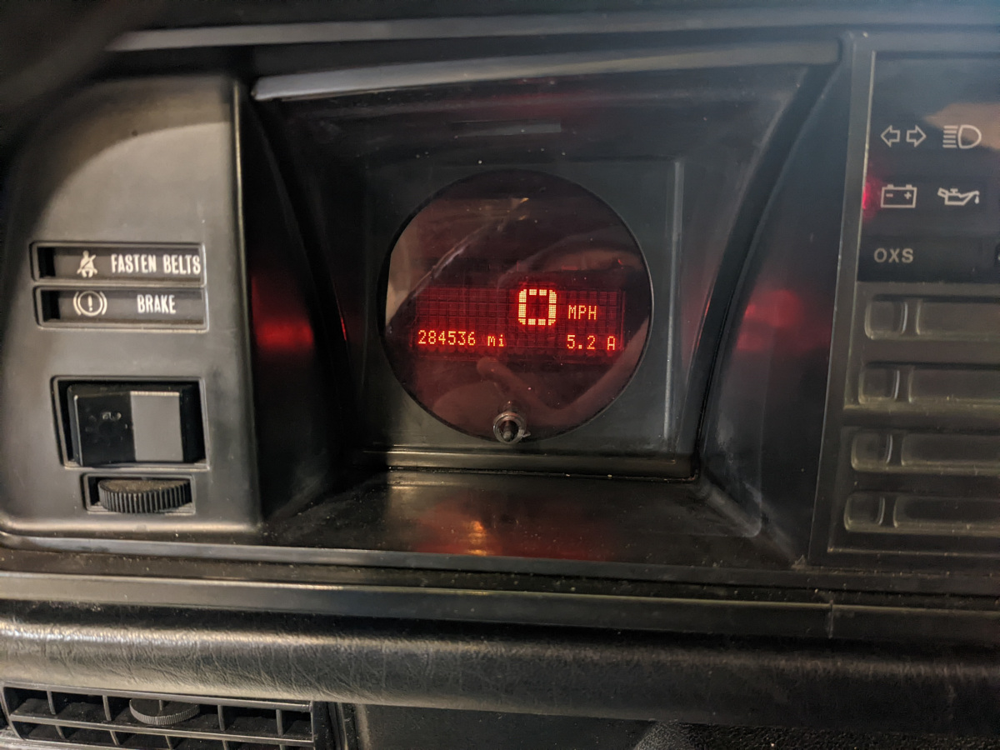

# Digital Vanagon Speedometer

Personal project to replace a broken Vanagon speedometer unit.

- Speedometer.
- Odometer.
- Trip A.
- Trip B.
- Oil mileage (e.g. trip C).

## Hardware

- Arduino UNO.
- 4×20 LCD display.
